# Express.js + Next.jsで実装するMCP Streamable HTTP Transport


## 1. はじめに

AIとのコミュニケーションを標準化するModel Context Protocol (MCP)は、クライアントとサーバー間の通信方式として新しいStreamable HTTP Transportを採用しています。本記事では、Express.jsとNext.jsを使用してこのStreamable HTTP Transportを実装する方法について、特にステートレスモードとステートフルモードの違いに焦点を当てて解説します。

前回の記事「[Express.js + Next.jsで実装するSSEリアルタイム通信](https://zenn.dev/sbk0716/articles/f70903db067a27)」では、Server-Sent Events (SSE)を使ったリアルタイム通信の基礎と実装方法について解説しました。本記事はその発展編として、MCPというより高度なプロトコルの実装方法を紹介します。前回学んだSSEの知識を基に、より実践的なアプリケーション開発へと進んでいきましょう。

### Express.jsとNext.jsの役割

本実装では、以下のようにExpress.jsとNext.jsを活用します：

- **Express.js**: サーバーサイドでMCP Streamable HTTP Transportを実装するためのHTTPサーバーフレームワークとして使用します。ルーティング、ミドルウェア、リクエスト/レスポンス処理などの機能を活用して、MCPサーバーを構築します。

- **Next.js**: クライアントサイドでMCPクライアントを実装するためのReactフレームワークとして使用します。サーバーコンポーネント、クライアントコンポーネント、APIルートなどの機能を活用して、リッチなユーザーインターフェースを構築します。

### 対象読者

- MCPを使ったアプリケーション開発に興味がある方
- ステートレス/ステートフルなサーバー実装の違いを理解したい方
- リアルタイム通信技術の実践的な応用例を知りたい方
- Express.jsとNext.jsを使った開発経験がある方

### 本記事で学べること

- MCPのStreamable HTTP Transportの概念と特徴
- ステートレスとステートフルの違いと適切な使い分け
- セッション管理の設計と実装アプローチ
- Next.jsフロントエンドとの連携方法

## 2. Streamable HTTP Transportの基礎

Model Context Protocol (MCP) の Streamable HTTP transport は、サーバーからクライアントへのレスポンスとして Server-Sent Events (SSE) 形式を使用する通信方式です（参照: MCP TypeScript SDK READMEの「Streamable HTTP」セクションと`StreamableHTTPServerTransport`クラスのコメント）。前回の記事「[Express.js + Next.jsで実装するSSEリアルタイム通信](https://zenn.dev/sbk0716/articles/f70903db067a27)」で解説したSSEの知識を基に、MCPの通信方式について理解を深めていきましょう。

### トランスポートの役割と責務

MCPにおけるトランスポートは、クライアントとサーバー間の通信を抽象化し、プロトコルの詳細を隠蔽する重要なコンポーネントです（参照: MCP TypeScript SDK の`Transport`インターフェースと`StreamableHTTPServerTransport`クラスのコメント）。トランスポートの主な責務は以下の通りです：

1. **通信チャネルの確立と維持**: クライアントとサーバー間の接続を確立し、維持する（参照: `StreamableHTTPServerTransport`と`StreamableHTTPClientTransport`クラスの`start()`メソッド）
2. **メッセージのシリアライズ/デシリアライズ**: JSON-RPCメッセージの変換を処理（参照: `StreamableHTTPServerTransport`の`handleRequest()`メソッド）
3. **プロトコルの実装**: HTTP、SSE、WebSocketなどの通信プロトコルの詳細を実装（参照: MCP TypeScript SDK READMEの「Streamable HTTP」セクション）
4. **エラーハンドリング**: 通信エラーの検出と適切な対応（参照: `Transport`インターフェースの`onerror`コールバック）
5. **セッション管理**: ステートフルモードでのセッションIDの生成と管理（参照: `StreamableHTTPServerTransport`の`sessionIdGenerator`オプション）
6. **再接続メカニズム**: 接続が切断された場合の再接続処理（参照: `StreamableHTTPClientTransport`の`lastEventId`オプション）

Streamable HTTP Transportは、これらの責務を以下のクラスで実装しています（参照: MCP TypeScript SDK の`server/streamableHttp.ts`と`client/streamableHttp.ts`ファイル）：

- **StreamableHTTPServerTransport**: サーバー側のトランスポート実装
- **StreamableHTTPClientTransport**: クライアント側のトランスポート実装

これらのクラスは、`Transport`インターフェースを実装しており、MCPサーバー/クライアントとの間で標準化された方法で通信します（参照: MCP TypeScript SDK の`Transport`インターフェース定義）。

### 特徴と利点

Streamable HTTP transportは、MCPの標準的な通信方式で、以下の特徴があります：

- HTTP POSTリクエストでクライアントからサーバーへメッセージを送信
- Server-Sent Events (SSE) 形式でサーバーからクライアントへレスポンスを返す
- 単一エンドポイント（通常は `/mcp`）で通信
- セッション管理機能（オプション）
- 再接続メカニズム
- 後方互換性のサポート

これにより、以下のような利点が得られます：

- **ステートレスなサーバー実装が可能**: 各リクエストを独立して処理できる
- **プレーンなHTTPサーバーとして実装可能**: 特別なプロトコルが不要
- **スケーラビリティの向上**: 物理的な接続維持が不要なため、多数のクライアントに対応可能
- **ネットワーク中断からの回復力**: 論理的なセッションIDを用いるため、物理的な接続が切れても対話を継続可能
- **水平スケーリングが容易**: セッションIDによるルーティングが可能
- **ファイアウォールフレンドリー**: 標準的なHTTPポートを使用するため、特別なポート開放が不要
- **プロキシ対応**: 標準的なHTTPプロキシを通過可能

### レスポンス形式

Streamable HTTP transportでは、サーバーからのレスポンスは以下のような形式になります：

#### 1. ヘッダー情報

```
Content-Type: text/event-stream
Cache-Control: no-cache
```

`text/event-stream` は SSE 形式のコンテンツであることを示します。

#### 2. SSEメッセージ構造

```
event: message
data: {"result":{"tools":[{"name":"dice","description":"サイコロを振った結果を返します","inputSchema":{"type":"object","properties":{"sides":{"type":"number","minimum":1,"default":6,"description":"サイコロの面の数"}},"additionalProperties":false,"$schema":"http://json-schema.org/draft-07/schema#"}}]},"jsonrpc":"2.0","id":1}
```

主な特徴：
- `event: message` - イベントタイプを示す行
- `data: {...}` - JSON形式のデータを含む行

#### 3. クライアント側での処理

クライアントからのリクエスト時には、以下のヘッダーを設定する必要があります：

```
Accept: application/json, text/event-stream
```

SSEレスポンスを処理するには、以下の手順が必要です：

1. レスポンスのテキストを取得
2. SSE形式かどうかを判定（`event:` または `data:` を含むか）
3. SSE形式の場合、`data:` で始まる行からJSONデータを抽出
4. 抽出したJSONデータをパース

```javascript
// SSEレスポンス処理の基本的な考え方
const text = await response.text();
let data;

if (text.includes('event:') || text.includes('data:')) {
  // SSEメッセージからJSONデータを抽出
  const jsonData = text.split('\n')
    .filter(line => line.startsWith('data:'))
    .map(line => line.substring(6).trim())
    .join('');
  
  data = JSON.parse(jsonData);
} else {
  // 通常のJSONレスポンスの場合
  data = JSON.parse(text);
}
```

詳細なコード例は実際のMCP TypeScript SDKのドキュメントを参照してください。

## 3. ステートレスモードとステートフルモードの比較

MCPのStreamable HTTP Transportでは、ステートレスモードとステートフルモードという2つの動作モードをサポートしています（参照: MCP TypeScript SDK README.mdの「With Session Management」と「Without Session Management (Stateless)」セクション、および`StreamableHTTPServerTransport`クラスのコメント）。それぞれの特徴と違いを理解することで、適切なモードを選択できるようになります。

### 動作モードの比較

以下の図は、ステートレスモードとステートフルモードの基本的な違いを示しています：

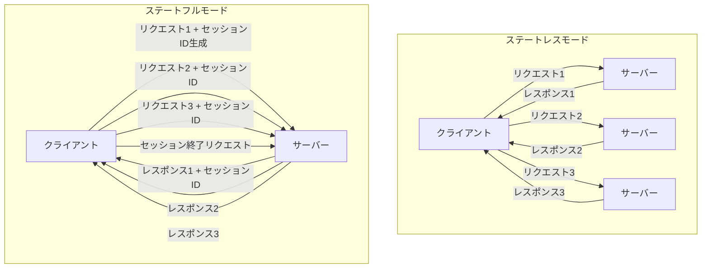

### ステートレスモード

ステートレスモードでは、サーバーはクライアントとのセッションを維持せず、各リクエストは独立して処理されます。

**特徴：**

- セッションIDを使用しない（`sessionIdGenerator: undefined`）
- リクエスト間で状態は保持されない
- 各リクエストごとに新しいトランスポートとサーバーインスタンスを作成
- DELETE リクエストは使用しない（セッション終了の概念がない）

**メリット：**

- シンプルな実装
- スケーラビリティが高い（ステートフルな情報を保持しないため）
- 水平スケーリングが容易
- サーバーリソースの効率的な利用

**デメリット：**

- 会話の文脈を維持できない
- 複雑な対話型アプリケーションには不向き
- 各リクエストで同じ情報を再送する必要がある場合がある

### ステートフルモード

ステートフルモードでは、サーバーはクライアントとのセッションを維持し、状態を保持します。

**特徴：**

- セッションIDを生成し、`Mcp-Session-Id`ヘッダーでやり取り
- イベントストアを使用してセッション状態を保持
- セッションは明示的に終了するか、タイムアウトするまで維持
- DELETE リクエストでセッションを終了

**メリット：**

- 会話の文脈を維持できる
- 複雑な対話型アプリケーションに適している
- セッション間で情報を共有できる
- ユーザー体験の向上（前回の状態を覚えている）

**デメリット：**

- 実装が複雑
- サーバーリソースの消費が大きい
- スケーリングが難しい（セッション情報の共有が必要）
- セッション管理のオーバーヘッド

### 適切な使用シーン

**ステートレスモードが適している場合：**

- シンプルなAPIラッパー
- 各リクエストが独立している場合
- 水平スケーリングが必要な場合
- セッション状態を共有する必要がない場合

**ステートフルモードが適している場合：**

- 対話型チャットアプリケーション
- ユーザーの状態を追跡する必要がある場合
- 複雑な会話の文脈を維持する必要がある場合
- セッションベースの認証が必要な場合

## 4. 実装アーキテクチャ

MCPのStreamable HTTP Transportを使用したアプリケーションの実装アーキテクチャについて解説します。

### 全体システム構成

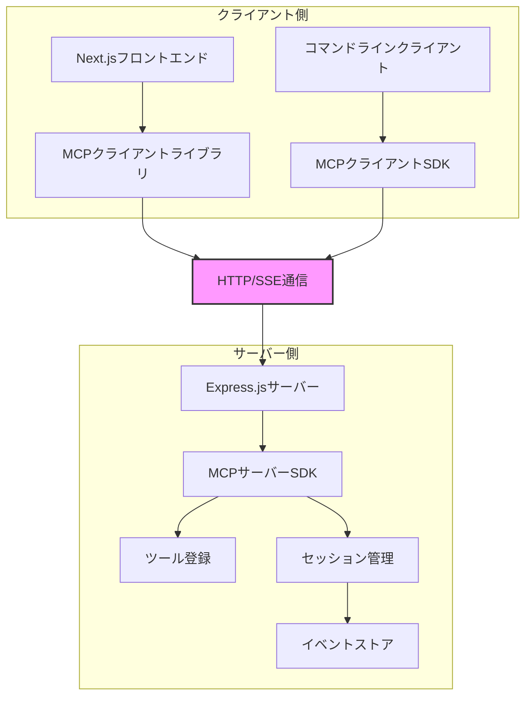

### コンポーネント間の関係

MCPアプリケーションは、以下の主要コンポーネントで構成されます：

1. **MCPサーバー**: ツールを登録し、クライアントからのリクエストを処理
2. **トランスポート**: クライアントとサーバー間の通信を担当
3. **イベントストア**: ステートフルモードでセッション状態を保持
4. **ツール**: サーバーが提供する機能（例：サイコロ）
5. **クライアント**: サーバーのツールを呼び出すアプリケーション

### データフロー

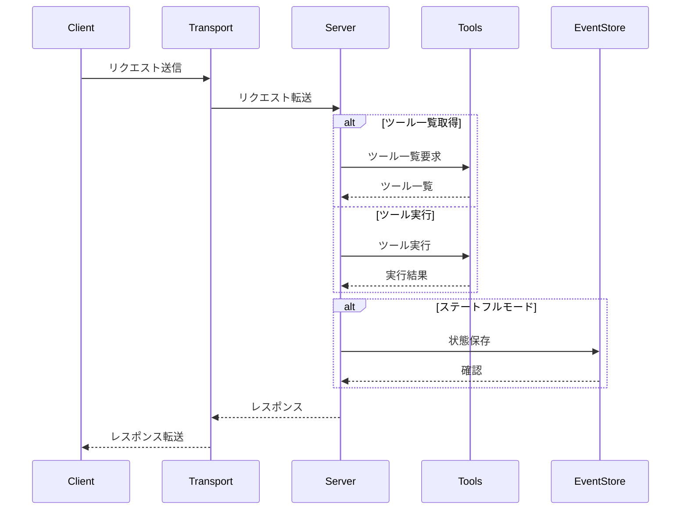

### 主要なインターフェースと責務

#### サーバー側

- **McpServer**: ツールの登録と管理
- **StreamableHTTPServerTransport**: HTTPリクエスト/レスポンスの処理
- **EventStore**: セッション状態の保存と取得（ステートフルモード）

#### クライアント側

- **Client**: サーバーとの通信を管理
- **StreamableHTTPClientTransport**: HTTPリクエスト送信とSSEレスポンス処理

### Express.jsを使用したサーバー実装

Express.jsを使用してMCPサーバーを実装する基本的な方法を紹介します。

#### ステートレス実装の基本構造

ステートレスサーバーの基本構造は以下の通りです：

```typescript
// stateless/server/src/index.ts の主要部分
import express from "express";
import { McpServer } from "@modelcontextprotocol/sdk/server/mcp.js";
import { StreamableHTTPServerTransport } from "@modelcontextprotocol/sdk/server/streamableHttp.js";
import { z } from "zod";

// Expressアプリケーションの作成
const app = express();
app.use(express.json());

// ステートレストランスポートの作成 - セッションIDジェネレーターをundefinedに設定
const transport = new StreamableHTTPServerTransport({
  sessionIdGenerator: undefined, // ステートレスモードを指定
});

// MCPサーバーの作成とツール登録
const mcpServer = new McpServer({
  name: "stateless-server",
  version: "1.0.0",
});

// サイコロツールの登録
mcpServer.tool(
  "dice",
  "サイコロを振った結果を返します",
  { sides: z.number().min(1).default(6).describe("サイコロの面の数") },
  async (input) => {
    const sides = input.sides ?? 6;
    const result = Math.floor(Math.random() * sides) + 1;
    return {
      content: [{ type: "text", text: result.toString() }],
    };
  }
);

// MCPサーバーとトランスポートを接続
await mcpServer.connect(transport);

// /mcp エンドポイントでリクエストを処理
app.post("/mcp", async (req, res) => {
  await transport.handleRequest(req, res, req.body);
});
```

完全な実装は、GitHubリポジトリの`stateless/server/src/index.ts`を参照してください。

このコードでは、Express.jsを使用してHTTPサーバーを作成し、MCPサーバーとStreamable HTTP Transportを設定しています。サイコロツールを登録し、`/mcp`エンドポイントでクライアントからのリクエストを処理します。

詳細なコード例は実際のMCP TypeScript SDKのドキュメントを参照してください。

## 5. ステートフル実装のポイント

ステートフルサーバーの実装では、セッション管理が重要な役割を果たします。ここでは、その主要なポイントを解説します。

### セッション管理の仕組み

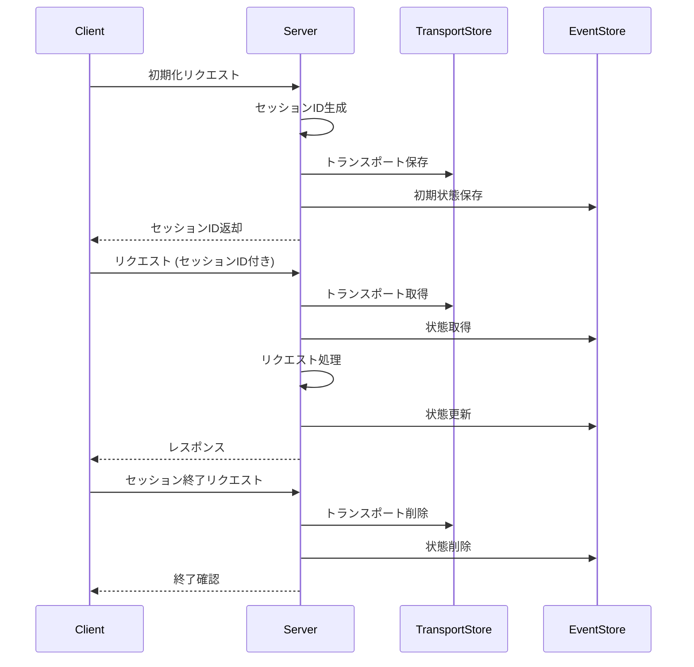

### Express.jsを使用したステートフル実装

ステートフルサーバーの実装例を見てみましょう：

```typescript
// stateful/server/src/index.ts の主要部分
import express from "express";
import { randomUUID } from "node:crypto";
import { McpServer } from "@modelcontextprotocol/sdk/server/mcp.js";
import { StreamableHTTPServerTransport } from "@modelcontextprotocol/sdk/server/streamableHttp.js";
import { InMemoryEventStore } from "@modelcontextprotocol/sdk/examples/shared/inMemoryEventStore.js";
import { z } from "zod";

// セッションIDごとにトランスポートを保持するオブジェクト
const transports: { [sessionId: string]: StreamableHTTPServerTransport } = {};

// Expressアプリケーションの作成
const app = express();
app.use(express.json());

// MCPサーバーの作成
const mcpServer = new McpServer({
  name: "stateful-server",
  version: "1.0.0",
});

// サイコロツールの登録
mcpServer.tool(
  "dice",
  "サイコロを振った結果を返します",
  { sides: z.number().min(1).default(6).describe("サイコロの面の数") },
  async (input) => {
    const sides = input.sides ?? 6;
    const result = Math.floor(Math.random() * sides) + 1;
    return {
      content: [{ type: "text", text: result.toString() }],
    };
  }
);

// ステートフルトランスポートの作成
const transport = new StreamableHTTPServerTransport({
  sessionIdGenerator: () => randomUUID(), // セッションIDとしてUUIDを生成
  eventStore: new InMemoryEventStore(), // セッション状態を保持するイベントストア
  onsessioninitialized: (sessionId) => {
    transports[sessionId] = transport; // セッションIDとトランスポートの対応を保存
  },
});

// MCPサーバーとトランスポートを接続
await mcpServer.connect(transport);

// POSTリクエストハンドラ
app.post("/mcp", async (req, res) => {
  await transport.handleRequest(req, res, req.body);
});

// DELETEリクエストハンドラ（セッション終了用）
app.delete("/mcp", async (req, res) => {
  const sessionId = req.headers["mcp-session-id"] as string | undefined;
  if (!sessionId || !transports[sessionId]) {
    res.status(400).send("Invalid session ID");
    return;
  }
  await transport.handleRequest(req, res);
});
```

完全な実装は、GitHubリポジトリの`stateful/server/src/index.ts`を参照してください。

### セッションIDの生成と管理

ステートフルサーバーでは、セッションIDを使用してクライアントとの会話状態を管理します（参照: `StreamableHTTPServerTransport`クラスの`sessionIdGenerator`オプションと、READMEの「With Session Management」セクション）。セッション管理の主なルールは以下の通りです：

1. クライアントから初期化リクエストを受け取ると、サーバーは新たにセッションIDを生成
2. セッションIDは`Mcp-Session-Id`ヘッダーでクライアントに返される
3. クライアントは後続のリクエストヘッダーに`Mcp-Session-Id`を含める
4. 初期化以外のリクエストで`Mcp-Session-Id`ヘッダーが欠けている場合、サーバーは400 Bad Requestを返す

セッションIDの生成と管理は、`StreamableHTTPServerTransport`の設定で行います：

```typescript
// セッションID生成の核となる部分
const transport = new StreamableHTTPServerTransport({
  sessionIdGenerator: () => randomUUID(), // UUIDをセッションIDとして生成
  eventStore, // イベントストアを設定
  onsessioninitialized: (sessionId) => {
    // セッションが初期化されたときの処理
    transports[sessionId] = transport; // セッションIDとトランスポートの対応を保存
  }
});
```

### イベントストアの活用

イベントストアは、セッション状態を保持するための重要なコンポーネントです（参照: `StreamableHTTPServerTransport`クラスの`eventStore`オプションと、READMEの「With Session Management」セクション）。基本的な実装では`InMemoryEventStore`を使用しますが、本番環境では永続的なストレージを検討すべきです。

```typescript
// イベントストアの基本的な責務
interface EventStore {
  getEvents(sessionId: string): Promise<Event[]>; // セッションの全イベントを取得
  appendEvent(sessionId: string, event: Event): Promise<void>; // イベントを追加
}
```

### セッション終了処理

セッションを明示的に終了するためには、DELETEリクエストを処理する必要があります（参照: READMEの「With Session Management」セクションのDELETEリクエストハンドラ部分）：

```typescript
// DELETE リクエストハンドラの核となる部分
app.delete("/mcp", async (req, res) => {
  const sessionId = req.headers["mcp-session-id"] as string | undefined;
  if (!sessionId || !transports[sessionId]) {
    res.status(400).send("Invalid session ID");
    return;
  }
  
  const transport = transports[sessionId];
  await transport.handleRequest(req, res); // SDKがセッション終了処理を行う
});
```

## 6. トランスポートのライフサイクル

トランスポートは、MCPアプリケーションの通信を担当する重要なコンポーネントです（参照: MCP TypeScript SDK の`Transport`インターフェースと`StreamableHTTPServerTransport`クラスの実装）。ここでは、トランスポートのライフサイクル全体について詳しく解説します。

### 初期化フェーズ

トランスポートの初期化は、以下のステップで行われます（参照: `StreamableHTTPServerTransport`と`StreamableHTTPClientTransport`クラスのコンストラクタとREADMEの「Streamable HTTP」セクション）：

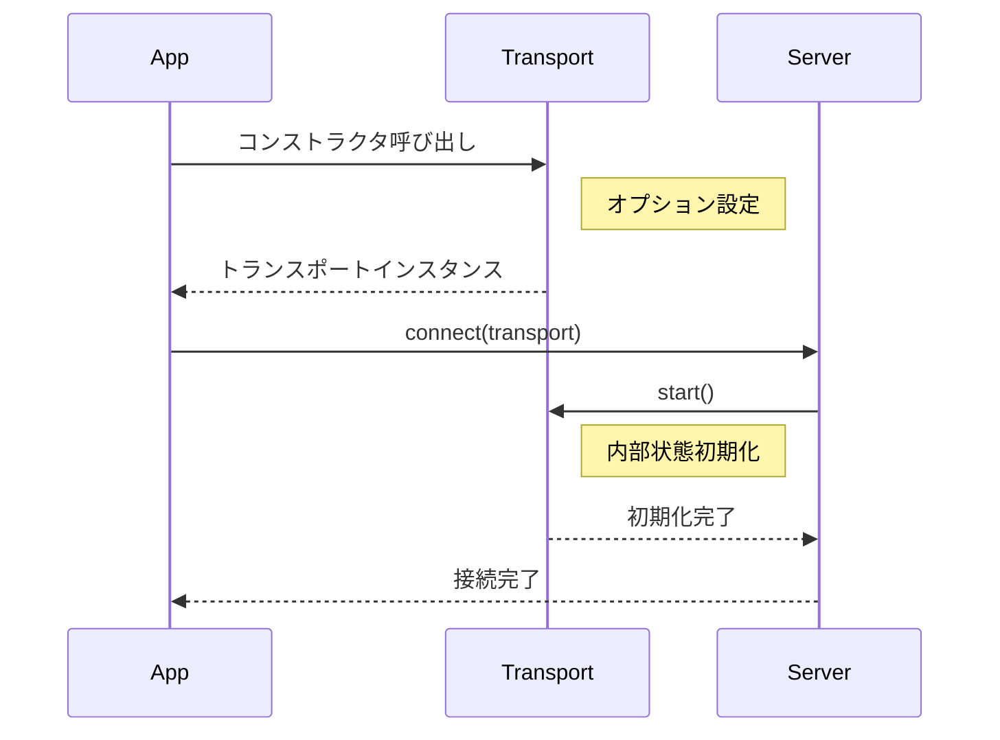

#### サーバー側の初期化

サーバー側のトランスポート初期化では、以下のオプションが重要です：

```typescript
// StreamableHTTPServerTransportの初期化オプション
interface StreamableHTTPServerTransportOptions {
  // セッションID生成関数 - undefinedの場合はステートレスモード
  sessionIdGenerator: (() => string) | undefined;
  
  // セッション初期化コールバック
  onsessioninitialized?: (sessionId: string) => void;
  
  // JSONレスポンスを有効にするかどうか
  enableJsonResponse?: boolean;
  
  // イベントストア - 再開可能性のサポート用
  eventStore?: EventStore;
}
```

#### クライアント側の初期化

クライアント側のトランスポート初期化では、以下のオプションが重要です：

```typescript
// StreamableHTTPClientTransportの初期化オプション
interface StreamableHTTPClientTransportOptions {
  // 既存のセッションID - 再接続時に使用
  sessionId?: string;
  
  // リクエスト初期化オプション - CORSなどの設定
  requestInit?: RequestInit;
  
  // 最後のイベントID - 再接続時に使用
  lastEventId?: string;
}
```

### 接続確立プロセス

トランスポートの接続確立は、以下のステップで行われます：

1. **クライアント側**:
   - `client.connect(transport)`を呼び出す
   - トランスポートの`start()`メソッドが実行される
   - 初期化リクエストを送信

2. **サーバー側**:
   - 初期化リクエストを受信
   - セッションIDを生成（ステートフルモードの場合）
   - 初期化レスポンスを返す

3. **接続確立後**:
   - クライアントはセッションIDを保存（ステートフルモードの場合）
   - サーバーはトランスポートとセッションIDの対応を保存（ステートフルモードの場合）

### メッセージ処理フロー

トランスポートのメッセージ処理フローは、以下のステップで行われます：

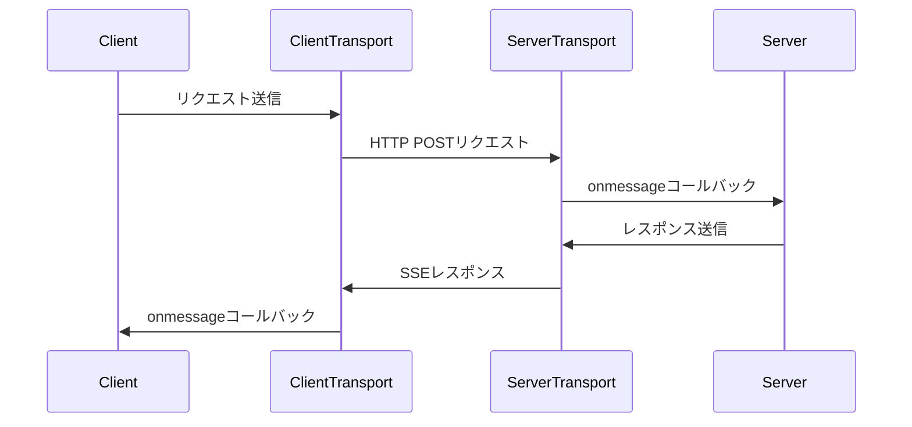

#### リクエスト処理

1. クライアントがリクエストを送信
2. クライアントトランスポートがHTTP POSTリクエストを作成
3. サーバートランスポートがリクエストを受信
4. サーバートランスポートがリクエストをJSONにパース
5. サーバートランスポートがサーバーの`onmessage`コールバックを呼び出し

#### レスポンス処理

1. サーバーがレスポンスを送信
2. サーバートランスポートがSSEレスポンスを作成
3. クライアントトランスポートがSSEレスポンスを受信
4. クライアントトランスポートがSSEメッセージをパース
5. クライアントトランスポートがクライアントの`onmessage`コールバックを呼び出し

### 終了処理

トランスポートの終了処理は、以下のステップで行われます：

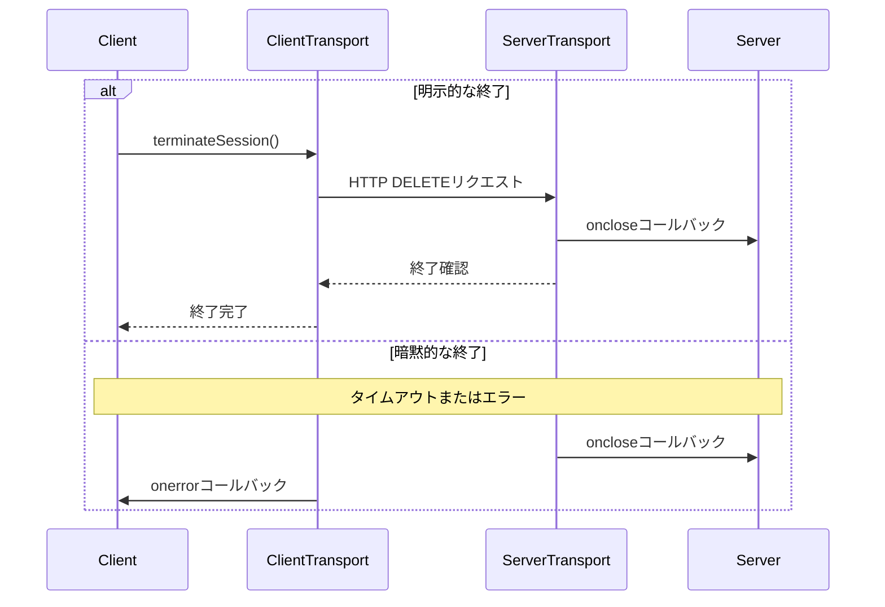

#### リソース解放

トランスポートの終了時には、以下のリソースが解放されます：

1. **サーバー側**:
   - トランスポートインスタンス
   - セッション情報
   - イベントストアのデータ

2. **クライアント側**:
   - トランスポートインスタンス
   - セッションID
   - SSE接続

## 7. フロントエンド連携のポイント

Next.jsフロントエンドでMCPクライアントを実装する際の主要なポイントを解説します。

### Next.jsでのMCPクライアント実装

Next.jsフロントエンドでMCPクライアントを実装する例を見てみましょう（参照: READMEの「Client-Side Compatibility」セクションと`StreamableHTTPClientTransport`クラス）。まず、クライアントライブラリを作成します：

```typescript
// stateful/frontend/lib/mcp-client.ts の主要部分
import { Client } from "@modelcontextprotocol/sdk/client/index.js";
import { StreamableHTTPClientTransport } from "@modelcontextprotocol/sdk/client/streamableHttp.js";

// シングルトンパターンのためのグローバル変数
let client: Client | null = null;
let transport: StreamableHTTPClientTransport | null = null;
let sessionId: string | undefined;

// クライアントの初期化
export async function initializeClient() {
  if (client && transport) return client;
  
  try {
    // クライアントとトランスポートの作成
    client = new Client({ name: "frontend-client", version: "1.0.0" });
    transport = new StreamableHTTPClientTransport(
      new URL("http://localhost:3000/mcp"),
      { sessionId } // 既存のセッションIDがあれば使用
    );
    
    // サーバーに接続
    await client.connect(transport);
    
    // セッションIDを保存
    sessionId = transport.sessionId;
    
    // ブラウザ環境であればセッションIDをローカルストレージに保存
    if (typeof window !== "undefined" && sessionId) {
      localStorage.setItem("mcp-session-id", sessionId);
    }
    
    return client;
  } catch (error) {
    console.error("Failed to initialize MCP client:", error);
    throw error;
  }
}

// ツール一覧の取得と実行のための関数
export async function listTools() {
  const mcpClient = await initializeClient();
  return mcpClient.listTools();
}

export async function callTool(toolName: string, params: any) {
  const mcpClient = await initializeClient();
  return mcpClient.callTool(toolName, params);
}

export async function terminateSession() {
  if (!transport || !sessionId) return;
  
  await transport.terminateSession();
  client = null;
  transport = null;
  sessionId = undefined;
  
  if (typeof window !== "undefined") {
    localStorage.removeItem("mcp-session-id");
  }
}
```

完全な実装は、GitHubリポジトリの`stateful/frontend/lib/mcp-client.ts`を参照してください。

このクライアントライブラリは、以下の機能を提供します：

1. **シングルトンパターン**: クライアントインスタンスを一元管理
2. **セッション状態の保持**: セッションIDをローカルストレージに保存
3. **エラーハンドリング**: 初期化や操作時のエラーをキャッチ
4. **ツール操作**: ツール一覧の取得やツールの実行
5. **セッション管理**: セッションの終了と状態のリセット

### Next.jsでのReactコンポーネント実装

Next.jsでMCPクライアントを使用するReactコンポーネントの実装例を見てみましょう：

```typescript
// stateful/frontend/src/app/components/MCPClient.tsx の主要部分
"use client";

import { useState, useEffect } from "react";
import { initializeClient, getSessionId, listTools, callTool, terminateSession } from "../../../lib/mcp-client";

export default function MCPClient() {
  // 状態管理
  const [sessionId, setSessionId] = useState<string | undefined>();
  const [tools, setTools] = useState<any[]>([]);
  const [diceResult, setDiceResult] = useState<string | null>(null);
  const [sides, setSides] = useState<number>(6);
  const [loading, setLoading] = useState<boolean>(false);
  const [error, setError] = useState<string | null>(null);

  // クライアント初期化
  useEffect(() => {
    const initialize = async () => {
      setLoading(true);
      try {
        await initializeClient();
        setSessionId(getSessionId());
      } catch (err) {
        setError("初期化エラー");
      } finally {
        setLoading(false);
      }
    };
    initialize();
  }, []);

  // ツール一覧の取得
  const handleListTools = async () => {
    setLoading(true);
    try {
      const result = await listTools();
      setTools(result.tools || []);
    } catch (err) {
      setError("ツール一覧取得エラー");
    } finally {
      setLoading(false);
    }
  };

  // サイコロツールの実行
  const handleRollDice = async () => {
    setLoading(true);
    try {
      const result = await callTool("dice", { sides });
      if (result.content?.length > 0) {
        setDiceResult(result.content[0].text);
      }
    } catch (err) {
      setError("サイコロ実行エラー");
    } finally {
      setLoading(false);
    }
  };

  // UI部分は省略 - 完全な実装はGitHubリポジトリを参照
  return (
    <div className="p-4 max-w-md mx-auto bg-white rounded-xl shadow-md">
      <h1 className="text-xl font-bold mb-4">MCP クライアント</h1>
      
      {/* セッション情報表示 */}
      <div className="mb-4 p-2 bg-gray-100 rounded">
        <p>セッション状態: {sessionId ? "アクティブ" : "未接続"}</p>
        {sessionId && <p className="text-xs truncate">ID: {sessionId}</p>}
      </div>
      
      {/* 操作ボタン */}
      <div className="space-y-4">
        <button onClick={handleListTools} disabled={loading || !sessionId}>
          ツール一覧を取得
        </button>
        
        <div>
          <input type="number" min="1" value={sides} 
                 onChange={(e) => setSides(parseInt(e.target.value) || 6)} />
          <button onClick={handleRollDice} disabled={loading || !sessionId}>
            サイコロを振る
          </button>
          {diceResult && <div>{diceResult}</div>}
        </div>
        
        {sessionId && (
          <button onClick={() => terminateSession()}>セッションを終了</button>
        )}
      </div>
      
      {error && <div className="text-red-500">{error}</div>}
    </div>
  );
}
```

完全な実装は、GitHubリポジトリの`stateful/frontend/src/app/components/MCPClient.tsx`を参照してください。

このReactコンポーネントは、以下の機能を提供します：

1. **クライアント初期化**: コンポーネントマウント時にMCPクライアントを初期化
2. **セッション状態の表示**: アクティブなセッションIDを表示
3. **ツール一覧の取得**: サーバーから利用可能なツールの一覧を取得
4. **サイコロツールの実行**: 面の数を指定してサイコロを振る
5. **セッションの終了**: アクティブなセッションを終了
6. **ローディング状態とエラー表示**: 非同期処理中の表示とエラーメッセージの表示

### Next.jsページでの使用

作成したMCPClientコンポーネントをNext.jsのページで使用する例を見てみましょう：

```typescript
// stateful/frontend/src/app/page.tsx
import MCPClient from "./components/MCPClient";

export default function Home() {
  return (
    <main className="min-h-screen p-8 bg-gray-50">
      <div className="max-w-4xl mx-auto">
        <h1 className="text-3xl font-bold mb-6 text-center">
          MCP Streamable HTTP Transport デモ
        </h1>
        <p className="text-gray-600 mb-8 text-center">
          Express.js + Next.jsで実装するMCP Streamable HTTP Transport
        </p>
        
        <MCPClient />
      </div>
    </main>
  );
}
```

### UIの構築

ユーザーインターフェースでは、以下の要素を考慮します：

1. **セッション状態の表示**: アクティブなセッションIDを表示
2. **ツール一覧と実行UI**: 利用可能なツールを表示し、実行できるUI
3. **ローディング状態**: 非同期処理中の表示
4. **エラー表示**: エラーメッセージの適切な表示

## 7. シーケンス図による通信フロー解説

### ステートレスモードの通信フロー

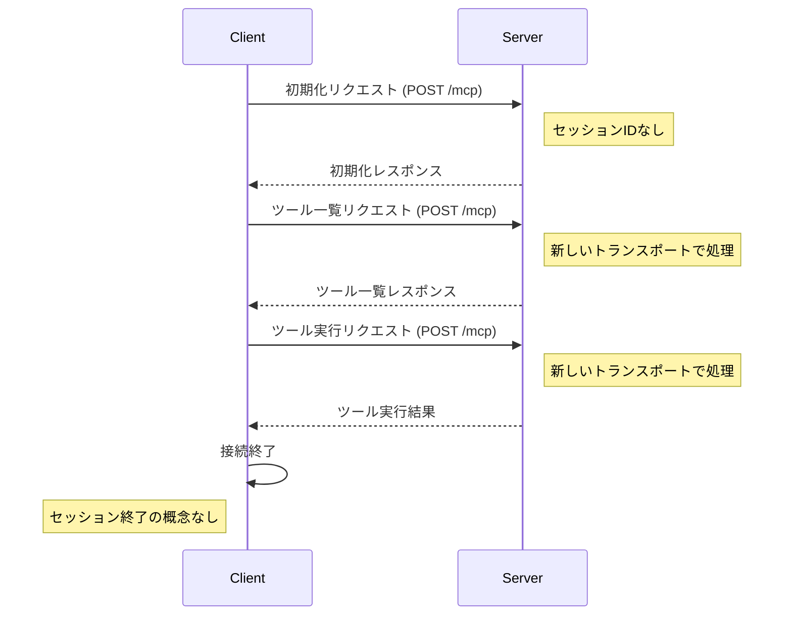

ステートレスモードでは、各リクエストが独立して処理されます。サーバーはリクエスト間で状態を保持せず、クライアントも特別なセッション管理を行いません。

### ステートフルモードの通信フロー

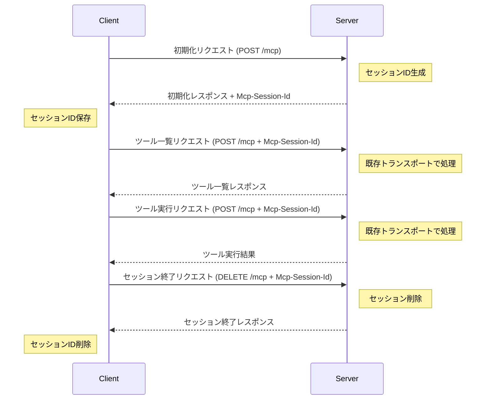

ステートフルモードでは、初期化リクエスト時にセッションIDが生成され、以降のリクエストではこのセッションIDを使用して状態を維持します。セッションは明示的に終了するか、タイムアウトするまで維持されます。

### セッション初期化と終了のシーケンス

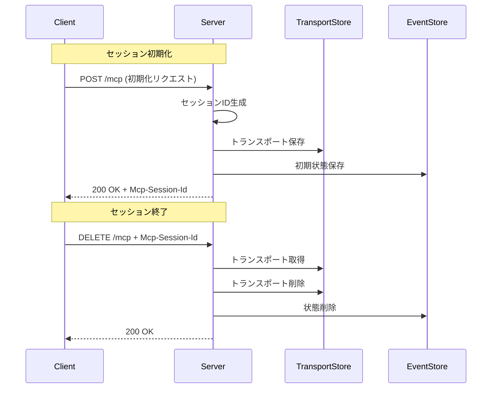

セッション初期化時には、サーバーがセッションIDを生成し、対応するトランスポートとイベントストアを設定します。セッション終了時には、これらのリソースが解放されます。

## 8. 実装のポイントと注意点

### パフォーマンス最適化のヒント

#### 永続的なイベントストア

本番環境では、メモリ内ストアではなく永続的なストレージを使用することを検討してください：

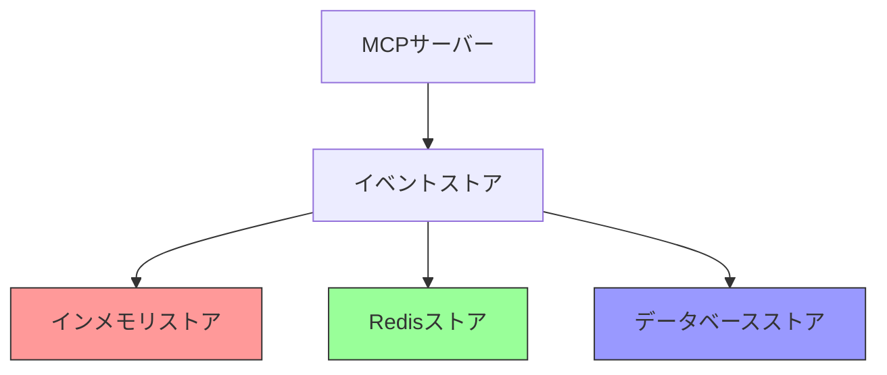

#### 水平スケーリングの考慮

ステートフルサーバーを複数インスタンスに水平スケーリングする場合の戦略：

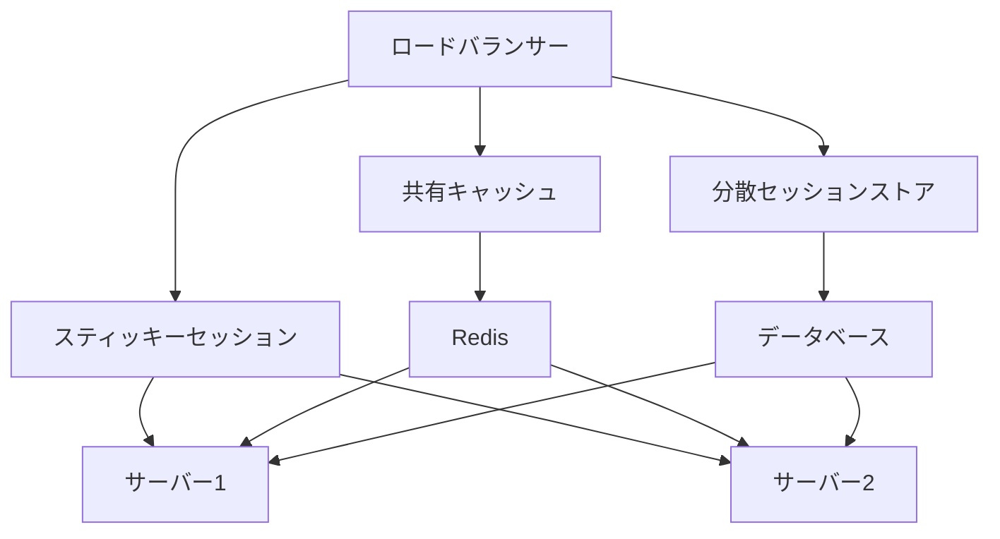

#### タイムアウト設定

長時間未使用のセッションを自動的に終了させる仕組みを実装することで、サーバーリソースを効率的に利用できます：

```typescript
// セッションクリーンアップの基本的な考え方
function setupSessionCleanup(transports, timeoutMs = 3600000) {
  setInterval(() => {
    const now = Date.now();
    for (const sessionId in transports) {
      const transport = transports[sessionId];
      const lastActivity = transport.lastActivityTime || 0;
      
      if (now - lastActivity > timeoutMs) {
        // 一定時間アクティビティがないセッションを終了
        transport.close();
      }
    }
  }, 60000); // 1分ごとにチェック
}
```

### エラーハンドリングの考え方

MCPアプリケーションでは、堅牢なエラーハンドリングが重要です（参照: MCP TypeScript SDK の`Transport`インターフェースの`onerror`コールバックと`Client`クラスの`onerror`プロパティ）。Streamable HTTP Transportでは、以下のようなエラーが発生する可能性があります：

1. **ネットワークエラー**: 接続の切断、タイムアウト、DNSエラーなど（参照: `StreamableHTTPClientTransport`クラスの`fetch`呼び出し部分）
2. **プロトコルエラー**: 不正なJSONレスポンス、不正なSSEフォーマットなど（参照: `StreamableHTTPClientTransport`クラスのSSEパース処理）
3. **アプリケーションエラー**: ツール実行エラー、認証エラーなど（参照: `McpServer`クラスのツール実行部分）
4. **セッションエラー**: 無効なセッションID、セッションタイムアウトなど（参照: `StreamableHTTPServerTransport`クラスのセッション管理部分）

これらのエラーに対処するためには、階層的なエラーハンドリング戦略が必要です：

```typescript
// クライアント側のエラーハンドリング例
try {
  // トランスポートレベルのエラーハンドリング
  transport.onerror = (error) => {
    console.error("Transport error:", error);
    
    // 再接続可能なエラーの場合
    if (isReconnectableError(error)) {
      reconnect();
    } else {
      // ユーザーに通知
      showErrorToUser("通信エラーが発生しました。再試行してください。");
    }
  };
  
  // クライアントレベルのエラーハンドリング
  client.onerror = (error) => {
    console.error("Client error:", error);
    
    // エラーの種類に応じた処理
    if (error.code === "SESSION_EXPIRED") {
      // セッションの再初期化
      reinitializeSession();
    } else {
      // ユーザーに通知
      showErrorToUser("エラーが発生しました。再試行してください。");
    }
  };
  
  // アプリケーションレベルのエラーハンドリング
  try {
    const result = await client.callTool("dice", { sides: 6 });
    // 結果の処理
  } catch (error) {
    // ツール実行エラーの処理
    console.error("Tool execution error:", error);
    showErrorToUser("ツールの実行中にエラーが発生しました。");
  }
} catch (error) {
  // 予期しないエラーの処理
  console.error("Unexpected error:", error);
  showErrorToUser("予期しないエラーが発生しました。");
}
```

エラーハンドリングの重要なポイント：

1. **階層的なエラーハンドリング**: トランスポート層、クライアント層、アプリケーション層でそれぞれ適切に対応
2. **エラーの分類と適切な対応**: 一時的なエラーは再試行、永続的なエラーはユーザーに通知
3. **リトライ戦略**: 指数バックオフなどの適切なリトライ戦略を実装
4. **ユーザーへのフィードバック**: エラーの種類に応じた適切なメッセージをユーザーに表示
5. **ログ記録**: デバッグや問題解決のためのエラーログの記録

### 再接続メカニズムの設計

ネットワークの切断や一時的なサーバーエラーに対応するための再接続メカニズムは、堅牢なアプリケーションには不可欠です（参照: `StreamableHTTPClientTransport`クラスの`lastEventId`オプションとREADMEの「Client-Side Compatibility」セクション）。以下は、効果的な再接続メカニズムの設計ポイントです：

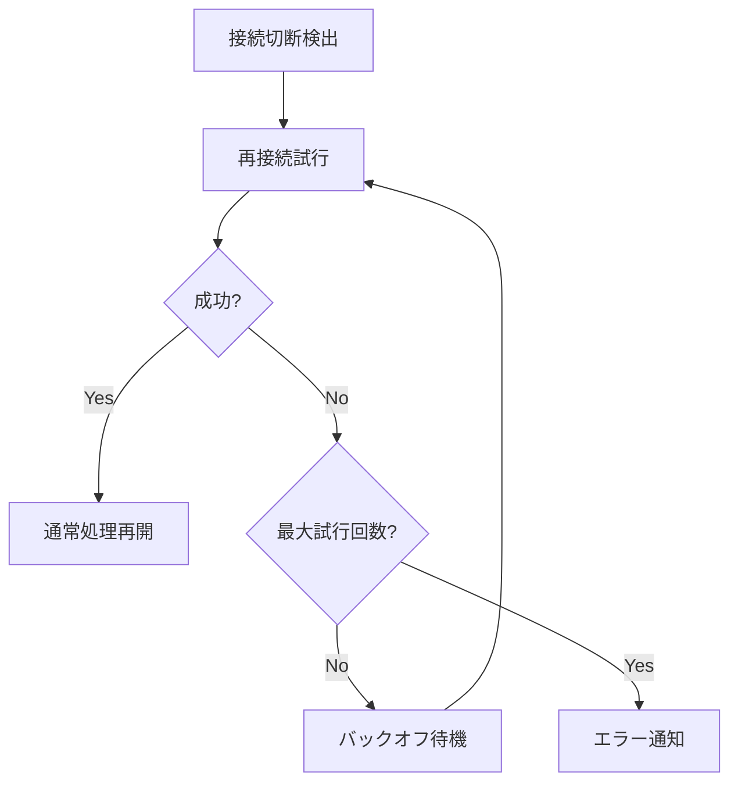

#### 指数バックオフアルゴリズム

再接続の試行間隔を徐々に長くすることで、サーバーへの負荷を軽減します：

```typescript
// 指数バックオフによる再接続の実装例
async function reconnectWithExponentialBackoff() {
  const maxRetries = 5;
  const baseDelay = 1000; // 1秒
  let retries = 0;
  
  while (retries < maxRetries) {
    try {
      // 再接続を試みる
      await client.connect(transport);
      console.log("再接続に成功しました");
      return true; // 成功
    } catch (error) {
      retries++;
      if (retries >= maxRetries) {
        console.error("最大再試行回数に達しました");
        return false; // 失敗
      }
      
      // 指数バックオフ: 1秒、2秒、4秒、8秒、16秒...
      const delay = baseDelay * Math.pow(2, retries - 1);
      console.log(`${delay}ミリ秒後に再試行します (${retries}/${maxRetries})`);
      await new Promise(resolve => setTimeout(resolve, delay));
    }
  }
  return false;
}
```

#### セッション状態の復元

ステートフルモードでは、再接続時にセッション状態を復元することが重要です：

```typescript
// セッション状態の復元例
async function reconnectWithSessionRestore() {
  // ローカルストレージからセッションIDを取得
  const sessionId = localStorage.getItem("mcp-session-id");
  if (!sessionId) {
    console.log("セッションIDがありません。新しいセッションを開始します。");
    return initializeNewSession();
  }
  
  try {
    // 既存のセッションIDで再接続
    transport = new StreamableHTTPClientTransport(
      new URL("http://localhost:3000/mcp"),
      { 
        sessionId,
        // 最後に受信したイベントIDがあれば指定（イベントの再送要求のため）
        lastEventId: localStorage.getItem("last-event-id")
      }
    );
    
    await client.connect(transport);
    console.log("セッションを復元しました:", sessionId);
    return true;
  } catch (error) {
    console.error("セッションの復元に失敗しました:", error);
    // セッションが無効になっている場合は新しいセッションを開始
    return initializeNewSession();
  }
}
```

#### 再接続時の考慮事項

1. **接続状態の監視**: WebSocketやSSE接続の状態を監視し、切断を検出
2. **バックオフ戦略**: サーバー負荷を軽減するための指数バックオフの実装
3. **最大再試行回数**: 無限ループを防ぐための最大再試行回数の設定
4. **ユーザーへの通知**: 接続状態の変化をユーザーに通知
5. **セッション状態の保存と復元**: セッションIDや最後に受信したイベントIDの保存と復元

### セキュリティ考慮事項

本番環境では、以下のセキュリティ対策を検討してください：

1. **HTTPS**: すべての通信をHTTPS経由で行う
2. **認証・認可**: OAuth 2.1などの認証機構を実装
3. **入力バリデーション**: すべてのユーザー入力を適切に検証
4. **レート制限**: APIの過剰な使用を防ぐためのレート制限
5. **セッションタイムアウト**: 長時間未使用のセッションを自動的に終了

## 9. 参考リソース

MCPの実装に関する詳細情報は、以下のリソースを参照してください：

- [MCP TypeScript SDK](https://github.com/modelcontextprotocol/typescript-sdk)
- [Model Context Protocol ドキュメント](https://modelcontextprotocol.io)
- [MCP 仕様](https://spec.modelcontextprotocol.io)
- [Express.js + Next.jsで実装するSSEリアルタイム通信](https://zenn.dev/sbk0716/articles/f70903db067a27)

## 10. おわりに

本記事では、MCPのStreamable HTTP Transportを使用したサーバー実装について、ステートレスモードとステートフルモードの違いを中心に解説しました。それぞれのモードには長所と短所があり、アプリケーションの要件に応じて適切なモードを選択することが重要です。

ステートレスモードは、シンプルさとスケーラビリティを重視する場合に適しています。各リクエストが独立して処理されるため、サーバーリソースを効率的に利用でき、水平スケーリングも容易です。

一方、ステートフルモードは、会話の文脈を維持する必要がある対話型アプリケーションに適しています。セッション管理の複雑さはありますが、ユーザー体験の向上につながります。

Streamable HTTP Transportを使用することで、ステートレスとステートフルの両方のアプローチでAIとのコミュニケーションを実現できます。用途に応じて適切なモードを選択し、効率的で拡張性の高いアプリケーションを構築しましょう。
